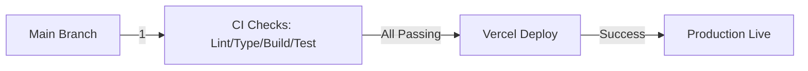

# Code Review Graph — YVON BI Dashboard

**Last updated:** 2026-04-21  
**Git repository:** `https://github.com/YVON/yvon-bi-dashboard.git` (pending approval)  
**Base branch:** `main` | **Dev branch:** `dev` | **Development:** `develop`

---

## Overview

This document defines the code review graph for YVON — a CLI-based AI operating system that orchestrates 13 agents across three layers, manages brand workspaces (Novizio: fashion e-commerce, Hourbour: fintech SaaS), and executes tasks across Novizio and Hourbour.

---

## Branch Strategy

### Main Branches

| Branch | Purpose | Auto-protected | Review Protocol |
|--------|---------|----------------|-----------------|
| `main` | Production stable | ✅ Required PR, passing checks, linear history, admin approval | SIP required for 3+ tool calls |
| `dev` | Pre-release integration | ✅ Required PR, passing checks | Pulse weekly quality gates |
| `develop` | Active development | ⚠️ Recommended PR (optional) | War Room for major changes |

### Branch Naming Convention

```regex
^(?!.*[\\\/]).*(feat|fix|docs|style|refactor|test|chore).+-[\w.-]+$
```

Examples: `feature/novizio-ai-agents`, `fix/hourbour-supabase-query`

---

## CI/CD Pipeline (`.github/workflows/ci.yml`)

### Automated Checks

1. **Lint** (`npm run lint`) — ESLint + Prettier
2. **TypeCheck** (`npm run typecheck`) — TypeScript strict mode
3. **Build** (`npm run build`) — Next.js production bundle
4. **Tests** (`npm run test` / `test:e2e`) — Unit + E2E tests
5. **Security Scan** (`npm audit --audit-level=high`) — Dependency security

### Deployment Pipeline



### Cron Jobs (Supabase Schedules)

| Path | Schedule | Trigger | Max Duration |
|------|----------|---------|---------------|
| `/api/trending` | 09:00 daily | AI trend aggregation | 30s |
| `/api/briefing` | 07:00 daily | CEO brief generation | 60s |
| `/api/competitor-content` | 08:00 Mon | Content research | 30s |
| `/api/calendar-verify` | 06:00 Sun | Calendar sync validation | 60s |

---

## Code Review Protocol

### War Room Sessions (Marcus)

**Trigger:** Strategy shifts, budget changes, brand direction, multi-agent coordination  

**Protocol:**
```typescript
// .github/workflows/ci.yml enforces this behavior
branch_protection_rules: { max_specialists: 2 } // War Room hard cap
```

**Required for PRs touching:**
- `agents/*` (multi-agent orchestration)
- `.yvon-os/` system configs
- `reference/SPEC-war-room.md` implementations
- Budget, revenue, or financial calculations (`agents/felix/*`)

---

### Pulse Protocol (Quinn)

**Frequency:** Weekly (every Friday)  
**Scope:** Random output sample from each layer  

| Layer | Agent | Scope | Output Format |
|-------|-------|-------|---------------|
| COMMAND | Marcus | Priorities, OKRs | CEO brief format |
| BUILD | Dev/Quinn | Code quality, tests | Pulse: 🟢🟡🔴 score |

---

### DRI Rule Enforcement

Every task requires exactly one Directly Responsible Individual.

```yaml
# Example: agents/marcus/MEMORY.md template
task_id: "2026-04-21-strategy"
dri: "marcus"  # Required: single owner
definition_of_done: "Strategy approved by Marcus + deployed to dev branch"
deadline: "2026-04-24T17:00Z"
```

---

## Security Rules (`.gitleaks.toml` / `.cursorrules`)

### Prohibited Secrets

| Pattern | Severity | Location |
|---------|----------|----------|
| `supabase_[A-Za-z0-9]{32}` | HIGH | All files except `api/*`, `.env.local` |
| `AKIA_[A-Z0-9]{16}` | CRITICAL | Production code only (AWS keys) |
| `ghp_[A-Za-z0-9]{36}` | HIGH | Git history, branches |

### Supabase Key Handling

```typescript
// ✅ Server-side only: app/api/[...route].ts
const serviceRole = process.env.SUPABASE_SERVICE_ROLE_KEY;

// ❌ NEVER client-side: components/*, pages/*
// localStorage for data is forbidden — Supabase only
```

---

## Review Gates (Required)

| Gate | When Triggered | Responsible | Tool |
|------|----------------|-------------|------|
| **Lint** | All PRs | ESLint + Prettier | GitHub Actions |
| **TypeCheck** | All PRs | TypeScript strict mode | GitHub Actions |
| **Build** | All PRs, Main-only | Next.js bundle | Vercel CI |
| **SIP** | 3+ tool calls | Marcus (strategy) / Quinn (quality) | Manual check in `reference/SIP.md` |
| **Pulse** | Weekly quality sample | Quinn | Automated + manual |

---

## Pre-commit Hooks & Scripts

### Snapshot Protocol (Session Start)

```bash
# Required before any brand work
scripts/snapshot.sh  # Generates .claude/branch-state.json
```

### Sync Protocol (Skill Edits)

```bash
# After editing Global Skills source (not copies)
scripts/skills-sync.sh
```

---

## Branch Protection Rules

### Main (Production)

- **Required PRs:** ✅ `main` protected against force pushes
- **Status Checks Required:** All pipelines must pass
- **Linear History Required:** ✅ Enforced (`--no-ff`)
- **Conversation Resolution Required:** ✅ Mandatory for all PRs
- **Admin Approval Required:** ✅ Prevents unauthorized access

### Dev (Development)

- **Required Pull Requests:** Yes
- **Required Status Checks:** Passing checks before merge
- **Linear History:** Optional (`allowed to rebase/merge` enabled)

---

## Git Workflow Summary

```mermaid
graph TD
    A[Feature Branch] -->|1| B[Fresh Snapshot Run]
    B -->|2| C[Commit Changes]
    C -->|3| D[PR: Lint + TypeCheck + Build]
    D -->|Passes SIP Gate?| E{SIP Required}
    E -->|Yes| F[War Room Review]
    E -->|No| G[Pulse Check Passed?]
    G -->|Weekly| H{Pulse Green?}
    H -->|No| I[Fix + Re-submit]
    H -->|Yes| J[Dev Merge]
    F -->|Approved| K[Deploy to dev (Vercel)]
    K --> L[CI: E2E Tests]
    L --> M{Tests Pass}
    M -->|No| I
    M -->|Yes| N[Main Push]
```

---

## Environment Variables

### Shared Reference (`reference/ENV.md`)

- `SUPABASE_URL` | Production database connection
- `SUPABASE_SERVICE_ROLE_KEY` | Server-side auth (never client)
- `NEXT_PUBLIC_SUPABASE_ANON_KEY` | Client-side JS SDK only

---

## Security Checklist for PR Merging

- [ ] No secrets in code except `.env.local` or production env vars
- [ ] All CI checks pass (Lint, Type, Build, Tests)
- [ ] SIP protocol followed if 3+ tool calls were required
- [ ] War Room approval if multi-agent scope changed
- [ ] Pulse score 🟢 for the feature change

---

## Next Steps

1. **Approve branch protection rules** → Configure GitHub branch protections
2. **Enable GitHub Actions** → Approve `ci.yml` workflow permissions
3. **Create brand branches:** `novizio/dev`, `hourbour/dev` (for team isolation)
4. **Test snapshot script:** Validate `scripts/snapshot.sh` generates correct structure

---

*Generated by Claude Code for YVON — respects CLAUDE.md protocols (War Room, Pulse, SIP, DRI)*
